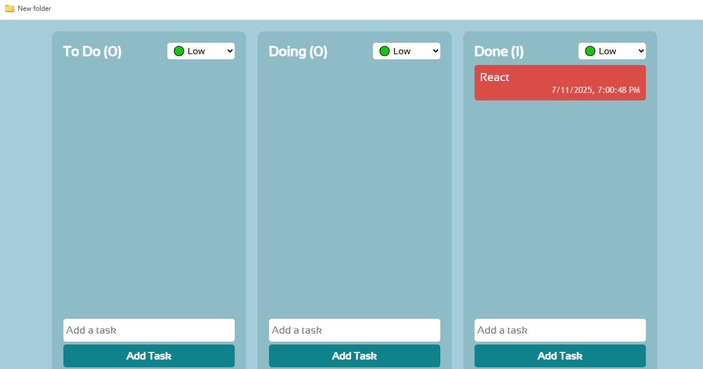

# 🧠 Kanban Task Board

A powerful and minimal Kanban-style Task Management Board built with **HTML, CSS & JavaScript**.

## 🔥 Features
- 🟢🟡🔴 Task Priority Levels (Low, Medium, High)
- 📥 Drag & Drop between "To Do", "Doing", and "Done"
- 📝 Edit or 🗑️ Delete Tasks with right-click menu
- 💾 Persistent data using **LocalStorage**
- ⏱️ Each task shows a timestamp
- 📱 Fully responsive on mobile

## 🎯 Tech Stack
- HTML5
- CSS3 (Responsive)
- Vanilla JavaScript (DOM + LocalStorage)

## 📸 Preview

## 🚀 How to Use
1. Clone this repo
2. Open `index.html` in browser
3. Start organizing your tasks 🎯

## 💡 Author
Made with ❤️ by [Rahul Sah](https://www.linkedin.com/in/rahhul-sah)

---

